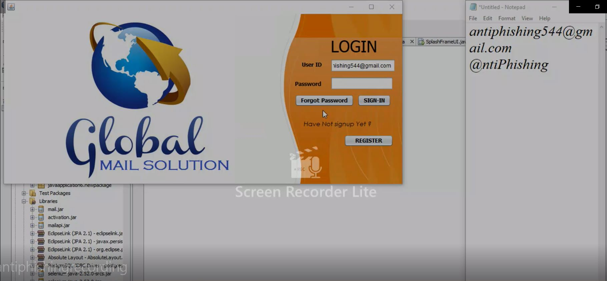

# AntiPhishing-Java-Application
Desktop Application for Scanning of Phishing Mails.
 
Automatically scans for mail and pushes in phishing box if mail contains suspicious content or does not follow Safe Rules

Tech Stack:
Java Swing,
Selenium,
Mail API for Java,

Video of Implimentation:

